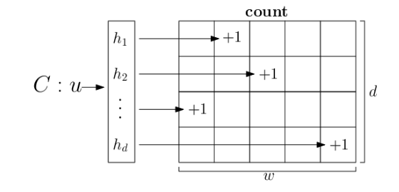
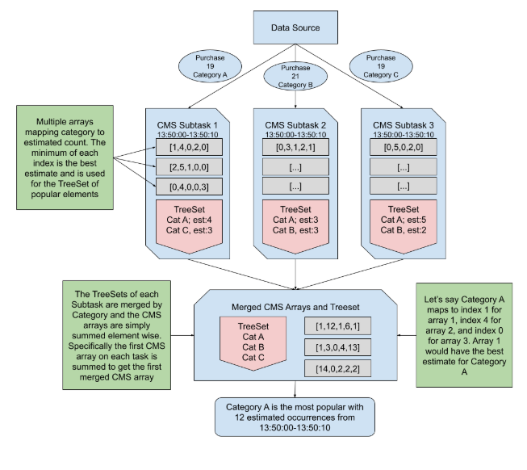

# cs532-final-project

## Usage

`cms2D/ProjectAnalysisJob` runs the final implementation which uses multi-dimensional sketches and category pruning. To run the job, right click the file in IntelliJ and click `Run PurchaseAnalysisJob main()` option. If this doesn't work go to the configurations and select:

    Add dependencies with "provided" scope to classpath 

Also, enable the `Add VM Options` and add the following to the field created:

    --add-opens=java.base/java.util=ALL-UNNAMED


Inside `cms2D/ProjectAnalysisJob`, configure the following variables:
```java
final int NUM_CORES = 10;       // Level of parallelism
final int WIDTH = 10;           // Length of the rows in each sketch
final int DEPTH = 5;            // Number of rows in each sketch
final int MAX_HOT_KEYS = 2;     // Size limit for local top categories set
```

Our prototype implementation can be ran with `cms1D/ProjectAnalysisJob`.
    
## Design Description

The [Amazon Sales Dataset](https://www.kaggle.com/datasets/karkavelrajaj/amazon-sales-dataset) contains ~1,400 rows of item purchases from Amazon. To construct an unbounded stream from this data, we created a rate-limited data source which generates random purchases from a distribution over item categories. This distribution can be tuned by specifying weights for each category in `resources/weights.yaml`. If the total weight of these specified categories is less than 100%, the remaining weight is uniformly distributed over unspecified categories. The dataset itself is stored as a CSV file, and the logic to parse it leverages [OpenCSV](https://opencsv.sourceforge.net/) and resides in `stream/PurchaseGenerator`. 

To estimate frequent items in the stream, we implemented the [count-min sketch](https://dsf.berkeley.edu/cs286/papers/countmin-latin2004.pdf) (CMS) data structure in cms2D/Sketch. CMS uses sublinear space but introduces an estimation error. Each `Sketch` encapsulates a 2D array of estimates. Each row in the array is associated with a `MurmurHash3.hash32x86` hash function. When an item arrives, its category is passed through each hash function, and the hashes are used to increment the counters of the corresponding rows. Notice counters never underestimate with this scheme, so the minimum counter is the best estimate for a given category’s frequency.



To achieve a distributed CMS, incoming items are randomly distributed across `NUM_CORES` workers using a `RandomKeySelector`. Workers run the `WindowCMS` process, which creates and updates a local `Sketch` object. After a set time interval, the workers submit their local sketches to a global coordinator running the `Merger` process. Sketches are merged by simply adding corresponding entries. 

Assuming the number of categories can be arbitrarily large, it would be costly to extract estimates for every category from a merged CMS. Instead, our solution has each worker maintain a size-limited `TreeSet`, which stores the top `MAX_HOT_KEYS` categories with the largest local estimates in `HotKey` objects. `TreeSet` was chosen since it supports item insertion and deletion in logarithmic time. Workers emit these categories along with their sketches. The coordinator then uses this reduced set on the merged CMS to determine frequent categories, significantly improving performance. This works because purchases are distributed randomly across the workers, which preserves relative frequencies in expectation. For instance, if there are 5 workers and a stream of 75 printers and 25 webcams,  each worker is expected to receive 15 printers and 5 webcams.  Thus, if printers are globally popular, they’re expected to be locally popular and likely represented in a `HotKey` emitted by a worker



## Tests
There are three test distributions included as YAML files in `resources`. To run a test, point the `WEIGHTS_FILE` variable in `distribution/CustomDistribution` to the desired YAML file, then run the program.
1. `test1.yaml`: This file doesn’t specify any categories, giving a uniform distribution.
2. `test2.yaml`: This file sets “Printers” to 99% and “Webcams” to 1%. 
3. `test3.yaml`: This file sets“Printers” to 60%, “Webcams” to 20%, and “Basic Cases” to 20%. 

## Experiments
The `metrics` directory contains utility classes used to test our system's performance. To run the program with these utilities, inside `cms2D/PurchaseAnalysisJob`, define:
```java
// Record metrics during run
DataStream<Purchase> purchases = env
    .addSource(new PurchaseSource())
    .name("transactions")
    .map(new PurchaseMetricsCollector())
    .name("metrics")
    .disableChaining();
```

`stream/PurchaseSource` can be altered to tune the stream input rate, and a variable `MAX_EVENTS` is included for tests that required bounding the stream. Analysis scripts are included in `analysis`. 
